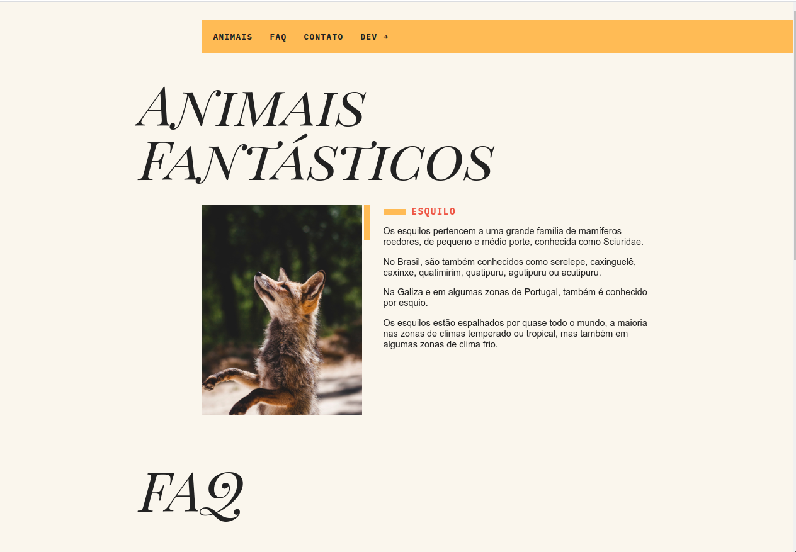

<h1 text-aling="center">Animais Fantásticos</h1>

O projeto Animais Fantásticos desenvolvido durante curso de JavaScript Es6 da Origamid.

<h1> Tecnologias</h1>
<strong>Esse projeto foi desenvolvido utilizando as seguintes tecnologias:</strong>
<ul>
 <li>HTML</li>
<li>CSS</li>
<li>JavaScript</li>
</ul>

<h2>Desafios e aprendizados ao longo do caminho</h2>

Como muitos sabem, aprender JavaScript requer prática, intensidade e acima de tudo, muito foco!
Felizmente estou indo bem e quero ficar melhor a cada dia!

